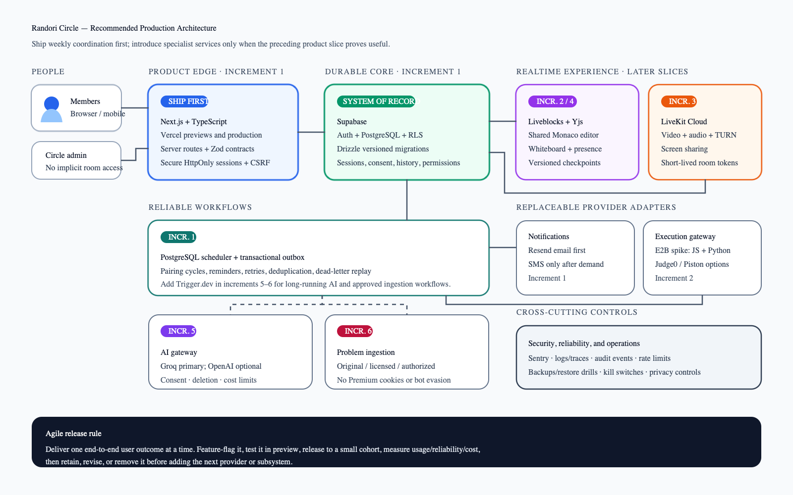

# Randori Circle: Production Architecture and Delivery Plan

Status: proposed  
Audience: product, engineering, security, and operations  
Last updated: 2026-09-17

## Executive decision

Randori Circle should become a secure, multi-circle platform for recurring peer mock interviews. Members join a circle, publish availability, receive a fair weekly pairing, agree a time, and enter one authenticated room containing collaborative code, a shared whiteboard, video, chat, questions, sandboxed execution, and optional AI coaching.

The current repository is a useful prototype, but it should not be extended in its present single-file form. The recommended path is a staged rebuild that preserves the product behavior and data where useful while replacing the fragile frontend, ad hoc schema management, unsafe trust boundaries, and browser-local collaboration model.

Recommended managed-service baseline:

- Next.js with React and TypeScript for the web application and server API.
- Supabase Auth plus PostgreSQL with Row Level Security for identity and durable application data.
- Drizzle ORM with versioned SQL migrations for application schema management.
- Liveblocks with Yjs, introduced in the collaborative-room increment, for collaborative Monaco editing, shared whiteboard state, cursors, and presence.
- LiveKit Cloud, introduced after the core peer workflow is useful, for video, audio, screen sharing, TURN, and reliable WebRTC connectivity.
- PostgreSQL scheduling plus a transactional outbox for the early pairing/reminder workflows; add Trigger.dev when AI or authorized ingestion makes durable orchestration worthwhile.
- A provider-neutral execution gateway, starting with a time-boxed E2B security/cost spike for JavaScript and Python and retaining Judge0 or self-hosted Piston as alternatives.
- A provider-neutral AI adapter, with Groq for economical low-latency feedback and OpenAI as an explicitly configured fallback.
- Resend for email and Twilio only when SMS demand justifies its cost and compliance burden.
- Sentry plus OpenTelemetry-compatible structured logs for errors, traces, and operational visibility.

The target composition is deliberately managed-service heavy, but the services are introduced only when a validated product slice needs them. This minimizes launch-time vendor sprawl while avoiding custom realtime, media, queue, and sandbox infrastructure. Every external system sits behind a replaceable adapter and a declared monthly cost ceiling.

## Product scope

### Core user journey

1. A user creates or joins a circle through an invitation.
2. The user completes a profile, timezone, interview focus, and dated availability.
3. A durable weekly job creates fair, idempotent pairings inside each circle.
4. Each pair proposes and accepts a normalized session time.
5. The pair enters an opaque, authenticated room.
6. Code, whiteboard, presence, chat, timer, selected question, and selected topic synchronize between members.
7. Code executes in an isolated remote sandbox.
8. With explicit participant consent, notes or a transcript can be sent for AI coaching.
9. A completed session becomes one coherent history record containing attendance, question, submissions, board snapshot, and feedback references.

### Explicit non-goals for the first production release

- A recruiting marketplace.
- Public discovery of people, emails, or pair history.
- Bulk mirroring of LeetCode's catalog or premium content without written authorization.
- Running untrusted code in the application browser or application server.
- Recording audio or video by default.
- Building a custom WebRTC SFU, TURN network, CRDT engine, or container scheduler.

## Agile delivery strategy

The rebuild uses a strangler approach: keep the current prototype available only to an allowlisted test group, build the new application beside it, and move one complete user journey at a time. Each increment must be independently deployable, measurable, and reversible.

### Smallest useful release

The first useful product does not need an integrated IDE, video, AI, SMS, or automated content ingestion. It needs to reliably create the weekly habit:

```text
Create circle -> Invite members -> Set availability -> Get paired
              -> Propose/accept a time -> Chat -> Open external meeting/problem link
```

This release uses only Next.js/Vercel, Supabase Auth/PostgreSQL, and Resend. It gives users immediate value while the technically harder shared-room features are built behind feature flags.

### Vertical slices

| Increment | User-visible value | New infrastructure | Release signal |
|---|---|---|---|
| 0. Safe private beta | Existing users can access a contained, repaired prototype | Current hosting only | No critical security issue; telemetry works |
| 1. Weekly coordination | Circles, invites, availability, pairing, schedule, chat, email | Next.js, Supabase, Resend | Teams complete pair-and-schedule flow weekly |
| 2. Shared coding | Two users edit the same document and run JS/Python safely | Liveblocks/Yjs, execution gateway | Successful two-browser sessions and repeat use |
| 3. Integrated calls | Reliable in-app video/audio and screen share | LiveKit | Connection success and session completion targets met |
| 4. Session workspace | Shared topic, timer, whiteboard, artifacts, unified history | Liveblocks Storage, object storage | Sessions recover after refresh/disconnect |
| 5. AI coaching | Consented, structured, deletable feedback | Trigger.dev, AI provider adapter | Feedback quality and cost thresholds met |
| 6. Content expansion | Licensed/original catalog and authorized imports | Approved source adapters | Rights review and source-specific limits pass |

Every increment follows the same loop:

1. Define the user outcome and one measurable success signal.
2. Implement behind a feature flag with a migration and rollback path.
3. Test in an isolated preview environment.
4. Release to a small cohort.
5. Observe reliability, usage, cost, and support burden.
6. Keep, adjust, or remove the slice before expanding it.

Defer infrastructure when a simpler product bridge works. For example, the first release can link to Google Meet and the source problem page; LiveKit and content ingestion are justified only after weekly pairing and scheduling show retention.

## Immediate containment and recovery

Before adding new features:

1. Put the current production application behind an allowlist or maintenance screen.
2. Fix the three invalid inline JavaScript blocks and add a parser/build gate.
3. Remove user-, chat-, question-, and model-controlled `innerHTML` paths.
4. Make missing JWT, cron, database, OAuth, and provider secrets fatal in production.
5. Rotate JWT and cron secrets after the XSS and fallback-secret fixes.
6. Remove emails and private profile fields from public responses.
7. Enforce pair membership on chat, schedule, AI-session, and signaling reads and writes.
8. Disable anonymous code execution, AI analysis, video signaling, schema initialization, and unrestricted log ingestion.
9. Stop the existing E2E workflow from writing to production.
10. Back up the Turso database before migration and define a rollback window.

These are containment actions, not the target architecture.

## Recommended architecture



Browser-viewable version: [SVG architecture diagram](./randori-production-architecture.svg). Editable source: [Excalidraw file](./randori-production-architecture.excalidraw).

```text
Users
  |
  v
Next.js web application on Vercel
  |-- Supabase Auth session in secure HttpOnly cookies
  |-- Typed REST endpoints with Zod validation
  |-- Server-rendered public shell and authenticated app
  |
  +--> Supabase PostgreSQL
  |      |-- RLS authorization
  |      |-- circles, memberships, pairings, sessions
  |      |-- schedules, chat, questions, submissions, consent
  |      +-- transactional outbox and audit events
  |
  +--> Liveblocks / Yjs
  |      |-- Monaco document
  |      |-- whiteboard objects
  |      +-- presence, cursors, room metadata
  |
  +--> LiveKit Cloud
  |      |-- audio/video
  |      |-- TURN/SFU
  |      +-- screen sharing
  |
  +--> PostgreSQL scheduler + transactional outbox
         |-- weekly pair generation
         |-- reminders and notification fan-out
         |-- AI feedback workflow
         +-- authorized question ingestion
                |-- policy/entitlement gate
                |-- cache, dedupe, provenance
                +-- approved source adapters

Later workflow adapter  --> Trigger.dev when AI/ingestion requires it
Code execution gateway --> E2B spike / Judge0 / self-hosted Piston
AI gateway             --> Groq / OpenAI
Notifications          --> Resend / optional Twilio
Observability          --> Sentry + structured logs/traces
```

## Architectural decisions

### AD-01: Next.js, React, and TypeScript

Decision: replace the single HTML file and overlapping inline scripts with a modular Next.js TypeScript application.

Why:

- Compile-time parsing and type checks prevent the current class of silent script failure.
- React provides predictable state and rendering boundaries instead of repeated DOM mutation and wrapper scripts.
- Next.js works naturally with Vercel previews, secure server routes, streaming UI, and Supabase authentication.
- The application can remain one deployable service while domain code is split into testable modules.

Proposed repository shape:

```text
apps/web/
  app/
  components/
  features/auth/
  features/circles/
  features/pairing/
  features/rooms/
  features/questions/
  features/feedback/
packages/domain/
packages/db/
packages/api-contracts/
packages/test-fixtures/
```

### AD-02: PostgreSQL and Supabase Auth/RLS

Decision: migrate durable state from ad hoc Turso/SQLite tables to PostgreSQL managed by Supabase.

Why:

- The product has relational authorization boundaries: circles, memberships, pairings, rooms, and participants.
- Row Level Security gives defense in depth for user-scoped data.
- Transactions, unique constraints, foreign keys, advisory locks, and `SKIP LOCKED` are useful for idempotent pairing and job processing.
- Supabase Auth removes custom password storage and gives verified email, OAuth, recovery, session rotation, and secure cookie patterns.

Browser clients never receive a service-role credential. User-scoped reads and writes go through the Next.js backend-for-frontend, which validates a same-site session and passes the user's Supabase JWT to a user-scoped Supabase client so `auth.uid()`-based RLS policies apply. Mutating routes also enforce Origin/CSRF checks. Drizzle is used for schema definitions, migrations, and carefully bounded server/background-job transactions; privileged jobs use a separate restricted role and explicit repository methods. RLS policies remain explicit SQL migrations and are tested independently.

### AD-03: One canonical session and room model

Decision: room IDs become random, opaque identifiers attached to a durable `session` row. Internal session UUIDs are distinct from Liveblocks and LiveKit provider-room identifiers; provider IDs are mapped server-side and never become the authorization boundary. Every public link resolves through the internal session ID.

Why:

- The current dashboard, email, and SMS generate incompatible room IDs.
- Predictable IDs expose rooms and signaling.
- A session entity provides one lifecycle for scheduling, attendance, collaboration, runs, and AI feedback.

Session states:

```text
draft -> scheduled -> ready -> live -> completed
  |          |          |       |
  +----------+----------+------> cancelled
             |
             +-----------------> no_show
```

`completed`, `cancelled`, and `no_show` are terminal sibling outcomes. Only session participants receive room tokens. Administrators do not receive implicit access to private interview content; any support or moderation access must be disclosed, time-limited, audited, and separately authorized.

### AD-04: Liveblocks and Yjs for collaboration

Decision: use Liveblocks Rooms with Yjs for the Monaco document and Liveblocks Storage for whiteboard objects and shared session state.

Why:

- Collaborative text requires CRDT conflict resolution, reconnect handling, awareness, and persistence.
- Liveblocks has established Monaco/Yjs and collaborative whiteboard patterns.
- Presence and cursors become remote-user concepts rather than browser-tab concepts.
- The application avoids owning a custom WebSocket fleet during the validation stage.

High-frequency transient updates remain in the collaboration service. Versioned checkpoints are written periodically and on important transitions so work survives crashes or abandoned sessions. Large code/board snapshots live in object storage; PostgreSQL stores ownership, version, hash, size, and retention metadata.

### AD-05: LiveKit Cloud for media

Decision: replace database-polled WebRTC signaling with LiveKit Cloud.

Why:

- TURN, SFU routing, reconnection, device switching, screen sharing, and network adaptation are difficult to operate safely.
- Signed, short-lived room tokens enforce membership.
- LiveKit can support future transcription or recording only after explicit consent.

### AD-06: Durable background workflows introduced incrementally

Decision: begin with PostgreSQL scheduling and a transactional outbox for pairing and email. Introduce Trigger.dev when later AI and authorized-ingestion workflows require longer execution, richer retries, or operator tooling.

Why:

- These flows need retries, idempotency, concurrency limits, timeouts, and audit history.
- Notification fan-out should not occur inside a cron HTTP request.
- Import jobs can be paused globally or per source when policy, rate, or provider health changes.

The database remains the source of truth. Domain changes and their outbox records are committed in one transaction. A polling or CDC relay claims rows with `FOR UPDATE SKIP LOCKED`, records delivery attempts, and dispatches stable deduplication keys. Failed events move to a dead-letter state with replay tooling. Trigger.dev receives outbox events; it is not treated as atomically committed merely because an API call was attempted.

### AD-07: Sandboxed execution gateway

Decision: remove browser `new Function` execution and route all untrusted code through a bounded execution gateway.

Initial scope: JavaScript and Python only. Run a time-boxed E2B proof of concept and ship it only after verifying regional availability, tenant isolation, outbound-network controls, CPU/memory/time limits, language versions, data handling, quotas, pricing, and incident support. The gateway keeps application secrets out of the sandbox, sanitizes all output, executes asynchronously, and selects tests server-side; clients never authoritatively report pass counts. Judge0 is the leading alternative when broader judge-style language support matters more than flexible sandboxes.

### AD-08: Provider-neutral AI coaching

Decision: define an internal `InterviewFeedbackProvider` contract and use schema-validated outputs.

Why:

- Pricing, model names, quotas, and provider availability change.
- Prompt and output validation should be independent of the provider.
- AI work needs explicit consent, retention policy, redaction, and deletion.

Groq is suitable for fast economical feedback; OpenAI is a useful optional fallback for structured output and transcription. Fallback must be visible in policy and configuration, not silent.

### AD-09: Compliant problem ingestion

Decision: do not build a crawler intended to imitate a human or evade LeetCode's anti-automation systems. A personal Premium subscription does not automatically grant redistribution or automated platform access.

Recommended source hierarchy:

1. Original Randori-authored questions and tests.
2. Publicly licensed problem sets with recorded license and attribution.
3. User-initiated import of a specific problem only when the source terms or written permission allow automated retrieval and storage.
4. Official or written-authorized LeetCode access for broader ingestion.

For any source that provides written automation permission, the ingestion adapter must:

- Identify itself honestly rather than mimic human traffic.
- Use concurrency one by default and a configurable daily request budget.
- Honor `429`, `Retry-After`, robots directives, contractual restrictions, and provider-specific limits.
- Cache by source ID and content hash; never refetch unchanged content unnecessarily.
- Use incremental cursors, exponential backoff, circuit breakers, and a global kill switch.
- Store source, license/entitlement, import time, hash, and last validation time.
- Keep credentials in a managed secret vault and never log cookies or authorization headers.
- Avoid persisting or redistributing premium statements, editorial content, or hidden tests without explicit rights.

Until written authorization exists, do not collect LeetCode session cookies and do not fetch or persist protected problem content on a user's behalf. Use outbound LeetCode links plus user-authored notes and independently authored test cases. Low request rates, random delays, robots compliance, or user initiation do not themselves grant permission. For every approved source, track rights scope and expiry, takedown contact, provenance review, and deletion obligations.

## Proposed data model

Core tables:

- `users`: application profile linked to the authentication provider.
- `circles`: owned collaboration groups.
- `circle_memberships`: role, status, joined time, notification defaults.
- `availability_rules`: recurring local-time preferences with timezone and effective dates.
- `availability_occurrences`: generated UTC windows for a specific pairing cycle, preserving DST behavior.
- `pairing_cycles`: one unique cycle per circle and week.
- `pairings`: algorithm version, deterministic seed, score, and explanation.
- `pairing_participants`: one row per participant, role, eligibility snapshot, and odd-member outcome.
- `sessions`: opaque room ID, lifecycle, topic, scheduled time, completion state.
- `session_participants`: authorization and attendance.
- `schedule_proposals`: normalized timestamps, source timezone, proposer, version, and status.
- `messages`: session-scoped chat with retention metadata.
- `questions`: canonical question metadata, license, source, version, visibility.
- `question_test_cases`: encrypted/hidden server-side cases where required.
- `submissions`: code, language, execution reference, authoritative result.
- `ai_consents`: participant consent, scope, provider, policy version.
- `ai_feedback`: schema version, model/provider, redaction status, retention time.
- `session_artifacts`: object-storage references for versioned code and board checkpoints.
- `notification_preferences`: channel-level opt-in and verified destinations.
- `outbox_events`: durable notification/job dispatch.
- `audit_events`: security- and admin-relevant actions.

Important constraints:

- Unique `(circle_id, week_start)` on pairing cycles.
- Unique `(cycle_id, user_id)` on pairing participants.
- Unique session per pairing unless an explicit reschedule version exists.
- At most one accepted schedule proposal per session, enforced with a partial unique index.
- Foreign keys on every relationship.
- Row Level Security based on circle and session membership.
- Idempotency keys on cron, notification, import, AI, and execution operations.

## Alternatives considered

### Frontend and application framework

| Option | Pros | Cons | Decision |
|---|---|---|---|
| Next.js + Vercel | Fast migration, preview deployments, strong React ecosystem, integrated server routes | Platform coupling, serverless limits for long-running work | Recommended |
| Remix + Fly.io | Clear web fundamentals, long-running server flexibility | More infrastructure and smaller collaboration examples | Good alternative if leaving Vercel |
| Vite SPA + separate API | Simple frontend and explicit API boundary | Two deployments, more auth/session/CORS plumbing | Viable when mobile/API clients become primary |
| Keep single HTML | Minimal build tooling | Current parse, security, testability, and maintainability failures remain | Rejected |

### Database and authentication

| Option | Pros | Cons | Decision |
|---|---|---|---|
| Supabase Postgres + Auth | Integrated auth, RLS, realtime, backups, SQL | Some vendor coupling; RLS requires disciplined testing | Recommended |
| Neon + Clerk + Drizzle | Excellent serverless Postgres and polished auth | More vendors and authorization glue | Strong alternative |
| Turso + custom JWT | Low latency and inexpensive | Current custom auth/migrations; weaker fit for tenant/RLS model | Keep only for prototype/archive |
| Convex | Excellent reactive backend and developer speed | Proprietary data/runtime model; relational pairing/reporting less natural | Consider for a fast greenfield MVP |

### Realtime collaboration

| Option | Pros | Cons | Decision |
|---|---|---|---|
| Liveblocks + Yjs | Fastest route to reliable Monaco, presence, and whiteboard collaboration | Recurring cost and vendor dependency | Recommended initially |
| Cloudflare Durable Objects + Yjs | Strong per-room consistency, global edge placement, lower long-term unit cost | More engineering and operational ownership | Best scale/control alternative |
| Supabase Realtime only | Already bundled with database | Not ideal by itself for CRDT text editing and complex whiteboards | Use for chat/domain events, not editor state |
| Custom WebSockets | Maximum control | Rebuilds persistence, fan-out, reconnect, conflict, and scaling logic | Rejected for initial production |

### Video

| Option | Pros | Cons | Decision |
|---|---|---|---|
| LiveKit Cloud | TURN/SFU, screen share, tokens, SDK quality | Usage cost | Recommended |
| Daily or Twilio Video | Mature managed media | Potentially higher cost and more platform coupling | Valid alternative |
| Self-host LiveKit | Control and lower cost at scale | Significant media/network/on-call burden | Revisit after product-market fit |
| Direct WebRTC + public STUN | Cheap | Unreliable NAT traversal and unsafe custom signaling | Rejected |

### Code execution

| Option | Pros | Cons | Decision |
|---|---|---|---|
| E2B | Strong isolated developer sandboxes and flexible workloads | More expensive and broader than a judge; controls must be verified | Recommended proof of concept for JS/Python |
| Managed Judge0 | Purpose-built multi-language judging, fast adoption | Hosting/vendor/SLA choice must be explicit | Leading broader-language alternative |
| Self-host Piston | Open source and controllable | Container isolation, patching, capacity, and abuse become our responsibility | Later cost-control option |
| Browser execution | Low latency for JavaScript | Same-origin token theft, infinite loops, inconsistent language support | Rejected |

### Background jobs

| Option | Pros | Cons | Decision |
|---|---|---|---|
| Trigger.dev | Durable workflows, schedules, retries, TypeScript | Additional managed service | Add with AI/ingestion complexity |
| Inngest | Excellent Vercel integration and event model | Additional managed service and pricing model | Equivalent alternative |
| Supabase Edge Functions + pg_cron | Fewer vendors | More custom orchestration, retries, and observability | Good for simpler workloads |
| Vercel Cron calling APIs | Simple | Weak durability and poor fit for fan-out or long ingestion | Insufficient alone |

For the first increment, PostgreSQL scheduling plus an outbox relay is preferred. Trigger.dev becomes recommended when AI or ingestion introduces genuinely long-running workflows.

### AI providers

| Option | Pros | Cons | Decision |
|---|---|---|---|
| Groq primary | Fast and economical | Model lifecycle and structured-output behavior can vary | Recommended behind an adapter |
| OpenAI primary | Strong structured output, transcription, broad platform | Higher cost and additional data-processing considerations | Strong alternative/fallback |
| Anthropic primary | Strong coaching and reasoning | Separate transcription requirement; structured integration differs | Good feedback-provider option |
| Single hardcoded provider | Simple | Creates pricing, outage, and migration risk | Rejected |

### Deployment topology

| Option | Pros | Cons | Decision |
|---|---|---|---|
| Vercel + managed services | Fastest launch, preview environments, low ops | Several vendors and recurring cost | Recommended through product validation |
| Fly.io/Render monolith + Postgres | Fewer conceptual services, long-lived connections | More scaling and deployment ownership | Good consolidation alternative |
| AWS full stack | Maximum control and enterprise options | Highest complexity and slowest iteration | Revisit only for regulatory or scale requirements |
| Cloudflare Workers + Durable Objects | Excellent realtime edge architecture | Different runtime constraints and greater implementation effort | Strong future optimization |

## Delivery plan

### Phase 0: containment and reproducible baseline

Outcome: current risk is contained and every commit is testable.

- Repair parser errors and stored XSS.
- Add a lockfile, `lint`, `typecheck`, `test`, and `build` checks.
- Run tests against a local/preview deployment and isolated database.
- Add exact assertions and fail on any unapproved browser error.
- Add environment validation and secure response headers.
- Inventory and back up production data.

Exit gate: no known critical vulnerability; source build and isolated smoke tests are required checks on protected `main`.

### Increment 1: identity, circles, and weekly coordination

Outcome: production-safe tenancy and data ownership.

- Introduce Supabase project separation for development, staging, and production.
- Implement Auth, secure cookies, email verification, recovery, and session revocation.
- Create circles, memberships, invitations, RLS policies, and audit events.
- Implement dated availability, transactional pairing, schedule proposals, chat, and email notifications.
- Let sessions link to an external meeting and source problem page before integrated media/content exists.
- Migrate accounts and profiles from Turso with verification reports. Plan for password reset rather than assuming Supabase can accept existing hashes; relink OAuth identities, invalidate old JWTs, and communicate the cutover.
- Make the old application read-only during final migration.

Exit gate: authorization tests prove cross-circle and cross-pair isolation, and pilot circles repeatedly complete the invite-to-scheduled-session journey.

### Increment 2: shared code and safe execution

Outcome: paired users can practice together inside Randori.

- Introduce canonical sessions and opaque room IDs.
- Integrate Liveblocks/Yjs with Monaco.
- Add periodic document checkpoints and recovery.
- Add the execution gateway for JavaScript and Python.
- Store authoritative results and connect submissions to the session timeline.

Exit gate: two independent browsers edit the same document, recover after refresh, and receive correct sandboxed results.

### Increment 3: integrated calls

Outcome: partners no longer need an external meeting tool.

- Integrate LiveKit video, audio, device controls, TURN, and screen sharing.
- Bind all room tokens to session membership and short expiry.

Exit gate: two browsers on different networks connect reliably, recover from interruption, and complete a session.

### Increment 4: complete session workspace

Outcome: a session has shared topic, timer, whiteboard, artifacts, and one coherent history.

- Add shared whiteboard state and periodic object-storage checkpoints.
- Add session completion, cancellation, and no-show outcomes.
- Add attendance and unified history across pairing, chat, submissions, and artifacts.
- Expand sandboxed languages only when each language passes its correctness and isolation suite.

Exit gate: completed sessions produce recoverable, correctly authorized artifacts and history.

### Increment 5: optional AI coaching

Outcome: optional, consented, measurable coaching.

- Add explicit participant consent and policy versioning.
- Validate model output against a versioned schema.
- Add redaction, retention, deletion, export, and provider disclosure.
- Run AI jobs asynchronously with bounded retries and budget controls.

Exit gate: privacy review, deletion test, provider-failure test, and cost-limit test pass.

### Increment 6: catalog expansion and authorized ingestion

Outcome: more practice content without creating legal or platform-access risk.

- Expand original and openly licensed content.
- Add rights, attribution, provenance, expiry, and takedown workflows.
- Enable only source adapters with confirmed legal or contractual permission.
- Never ingest via anti-bot evasion or user Premium cookies.

Exit gate: each active source has documented rights and automated enforcement of its limits.

### Continuous launch hardening

Outcome: controlled public production release.

- Accessibility audit and keyboard/focus remediation.
- Performance budgets and mobile/cross-browser testing.
- Backups, restore drill, incident runbook, alerts, SLOs, and rollback.
- Staged beta, feature flags, abuse monitoring, and support workflow.

Exit gate: launch checklist signed off across product, engineering, privacy, and operations.

## Pairing fairness specification

“Fair” is measurable rather than subjective. Each cycle records:

- The immutable eligibility snapshot and reasons for exclusion.
- Timezone overlap and selected focus compatibility.
- Explicit blocks or do-not-pair constraints.
- Repeat penalties across configurable historical windows.
- Odd-member rotation so the same person is not repeatedly assigned the fallback outcome.
- The deterministic random seed and algorithm version.
- Candidate scores and the final choice explanation.

Metrics include repeat rate, unmatched/AI-assigned rate, timezone-overlap quality, distribution of fallback assignments, cancellations, and completed-session rate. Administrators may rerun a cycle only through an audited, idempotent workflow.

## Migration and rollback policy

- Inventory current users, memberships, pair history, chats, runs, and AI sessions before deciding what to migrate.
- Migrate accounts/profiles and recent pair history; archive older chats, runs, and AI data unless users explicitly need them.
- Require password users to reset and verify their email; relink Google identities after verified sign-in.
- Invalidate legacy JWTs at cutover.
- Reconcile row counts, ownership, hashes, and sampled records before switching reads.
- Run dual-read comparison without dual-writing user mutations.
- Keep the source database read-only and restorable for a defined rollback window.
- Publish user-facing notice covering authentication reset, archived data, and deletion/export options.

## Testing strategy

- Unit tests: pairing algorithm, permissions, validation, state transitions, runner result parsing.
- Database tests: RLS, constraints, migrations, idempotency, concurrency, rollback.
- Contract tests: every API status and response schema.
- Integration tests: auth, invitations, pair membership, notifications, imports, AI and execution provider failures.
- Realtime tests: two independent browser contexts editing code and board concurrently.
- Media tests: token authorization, device denial, reconnection, TURN path, screen sharing.
- Security tests: stored/reflected XSS, IDOR, OAuth state, session revocation, rate limits, room access.
- End-to-end tests: complete journey against an isolated preview environment.
- Accessibility: automated axe checks plus keyboard and screen-reader review.
- Production smoke tests: read-only, synthetic accounts in a dedicated production test circle.

## Operational and security baseline

- Development, staging, and production are separate projects and databases.
- `main` is protected and requires build, tests, migration checks, and security scanning.
- Secrets live only in platform secret managers and are validated at startup.
- All privileged actions are audited.
- Durable global rate limits cover auth, invitations, logs, execution, AI, ingestion, and room-token issuance.
- Security headers include CSP, HSTS, `nosniff`, Referrer Policy, Permissions Policy, and clickjacking protection.
- Personally identifiable and interview-derived data has declared purpose, retention, export, and deletion behavior.
- Backups are automatic and a restore is exercised before launch.
- Provider adapters have timeouts, retries, circuit breakers, idempotency, cost limits, and kill switches.

## Success criteria

Randori is ready for production only when:

- Two remote participants can reliably join one authorized room and share code, board, presence, and media.
- A member cannot read or modify another circle's or pair's data.
- Pairing is idempotent, fair, transactional, timezone-aware, and explainable.
- Every supported language executes in an isolated sandbox with authoritative results.
- No crawler depends on evading platform controls; each content source has documented permission and provenance.
- AI processing is consented, schema-validated, deletable, and bounded by cost and retention controls.
- CI tests the exact candidate build without writing to production.
- Backups, monitoring, alerts, rollback, incident response, privacy documentation, and support ownership are operational.
